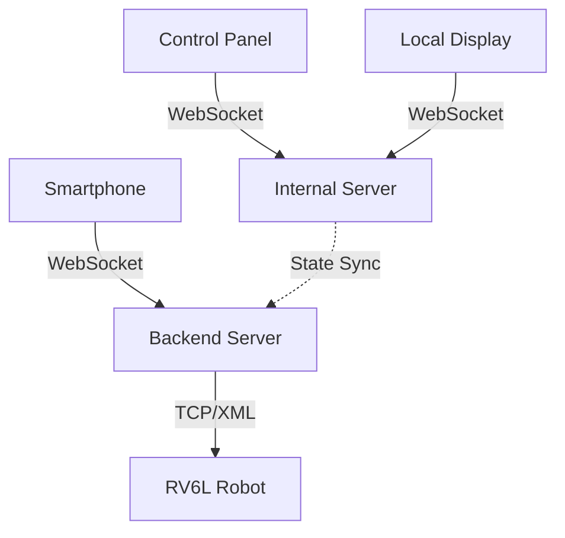

# Connect4 RV6L – Vier Gewinnt mit Roboterarm 🤖

[](https://choosealicense.com/licenses/mit/)
[](https://www.typescriptlang.org/)
[](https://nextjs.org/)
[](https://www.docker.com/)

> **Ein interaktives Vier-Gewinnt-Spiel mit einem Reis RV6L-Roboterarm, der Chips physisch auf einem echten Spielfeld platziert.**

## 📋 Inhaltsverzeichnis

- [Überblick](#-überblick)
- [Architektur](#-architektur)
- [Repository-Struktur](#-repository-struktur)
- [Komponenten](#-komponenten)
  - [Backend](#backend)
  - [Mobile Frontend](#mobile-frontend)
  - [Control Panel](#control-panel)
  - [Local Frontend](#local-frontend)
  - [Component Library](#component-library)
  - [RV6L Client](#rv6l-client)
- [Installation & Entwicklung](#-installation--entwicklung)
- [Deployment](#-deployment)
- [API Dokumentation](#-api-dokumentation)
- [Umgebungsvariablen](#-umgebungsvariablen)
- [Troubleshooting](#-troubleshooting)
- [Lizenz](#-lizenz)

## 🎯 Überblick

Das Connect4 RV6L-Projekt ermöglicht es Spielern, über ihr Smartphone gegen eine KI in einem physischen Vier-Gewinnt-Spiel anzutreten. Ein Reis RV6L-Roboterarm führt dabei alle physischen Bewegungen aus - sowohl für Spieler- als auch für KI-Züge.

### ✨ Features

- 🎮 **Mobile Spieler-UI** für Smartphone-basiertes Gameplay
- 🤖 **Vollautomatische Robotersteuerung** mit Reis RV6L-Arm
- 🎛️ **Control Panel** für Operatoren und Wartung
- 📺 **Local Display** für Zuschauer vor Ort
- 🔧 **Mock-Modus** für Entwicklung ohne Hardware
- 📊 **Live-Monitoring** und Fehlerprotokollierung
- 🎯 **3 Schwierigkeitsgrade** der KI

## 🏗️ Architektur



### Kommunikationsfluss

- **Spielergerät** ↔ Backend (WebSocket `/play`)
- **Control Panel** ↔ Interner Server (WebSocket `/controlpanel`) 
- **Local Frontend** ↔ Interner Server (WebSocket `/ws`)
- **Backend** ↔ RV6L-Client (TCP, XML-Protokoll)

> 📊 Eine detaillierte Architektur-Grafik finden Sie unter `/controlpanel/public/architecture.svg`

## 📁 Repository-Struktur

```
connect4rv6l/
├── 📁 backend/              # Game-Server & RV6L-Client
├── 📁 mobilefrontend/       # Spieler-UI (Next.js)
├── 📁 controlpanel/         # Operator-Interface (Next.js)
├── 📁 localfrontend/        # Display vor Ort (Vite/React)
├── 📁 component-lib/        # Wiederverwendbare UI-Komponenten
├── 🐳 docker-compose.yaml   # Container-Orchestrierung
├── 🐳 Dockerfile           # Production Build
└── 📖 README.md            # Diese Datei
```

## 🧩 Komponenten

### Backend

**Technologie:** Bun + Express + TypeScript

Der Backend-Server verwaltet die Spiellogik, Zustandsmaschine und Kommunikation mit dem Roboter.

#### Hauptfeatures
- 🎮 Game-Engine basierend auf `connect4-ai`
- 🔄 Zustandsmaschine für Spielablauf
- 🤖 RV6L-Roboter TCP-Client
- 📊 Session-Management
- 🚨 Zentrales Fehler-Logging

#### Ports
- **3000:** Haupt-API und WebSocket für Spieler
- **4000:** Interner Server für Control Panel und Local Display

#### Zustandsmaschine

```typescript
enum GameState {
  IDLE = "Wartet auf Spielstart",
  PLAYER_SELECTION = "Spieler wählt Spalte",
  GRAB_BLUE_CHIP = "Roboter greift Spieler-Chip",
  PLACE_BLUE_CHIP = "Roboter platziert Spieler-Chip",
  ROBOT_SELECTION = "KI berechnet Zug",
  GRAB_RED_CHIP = "Roboter greift KI-Chip",
  PLACE_RED_CHIP = "Roboter platziert KI-Chip",
  PLAYER_WIN = "Spieler gewinnt",
  ROBOT_WIN = "KI gewinnt",
  TIE = "Unentschieden",
  CLEAN_UP = "Feld wird geräumt",
  ERROR = "Fehlerzustand",
  SLEEP = "Ruhemodus"
}
```

### Mobile Frontend

**Technologie:** Next.js (Port 8080)

Responsive Spieler-Interface für Smartphones.

#### Features
- 🎯 Spaltenauswahl durch Tippen
- 🎚️ Schwierigkeitsgrad-Einstellung
- 📱 Touch-optimierte UI
- 🔄 Live-Status-Updates
- 🔄 Indoor/Outdoor-Ansicht (Spiegelfunktion)

#### Verbindung
```javascript
// WebSocket-Verbindung
ws://localhost:3000/play?sessionID=...
```

### Control Panel

**Technologie:** Next.js

Operator-Interface für Wartung und manuelle Steuerung.

#### Features
- 📊 **Live-Status:** GameState, Session, RV6L, Errors
- 🎛️ **State-Steuerung:** Reset, State-Wechsel
- 🤖 **Manuelle Robotersteuerung**
- 🎯 **Board-Override** für manuelle Korrekturen
- 📋 **Fehlerprotokoll** mit Pagination

#### Manuelle Steuerungskommandos
```typescript
interface ControlCommand {
  action: "control";
  command: 
    | "gripper_on" | "gripper_off"
    | "move_to_blue" | "move_to_red"
    | "move_to_column" // + { column: number }
    | "init_chip_palletizing"
    | "clean_board_at" // + { x: number, y: number }
    | "put_back_blue" | "put_back_red"
    | "move_to_ref_pos"
    | "cancel_rv6l"
    | "mock_rv6l"; // + { mock: boolean }
}
```

### Local Frontend

**Technologie:** Vite + React

Anzeigebildschirm für Zuschauer vor Ort.

#### Features
- 🎮 Live-Board-Anzeige
- 📱 QR-Code zum Mitspielen
- 🎯 Aktuelle Spielphase
- 📊 Schwierigkeitsgrad-Anzeige

### Component Library

Wiederverwendbare UI-Komponenten für alle Frontends.

#### Enthält
- 🎮 `GameField` - Vier-Gewinnt-Board
- 🧪 Storybook-Setup
- ✅ Vitest-Tests

### RV6L Client

TCP-Client für die Kommunikation mit dem Reis RV6L-Roboterarm.

#### Features
- 🔌 **TCP-Verbindung** zu `192.168.2.1:80`
- 📡 **XML-Protokoll** über symbolApi
- 🔄 **Reconnect-Logik** bei Verbindungsverlust
- 🧪 **Mock-Modus** für Entwicklung ohne Hardware
- ⏹️ **Interrupt-Funktionalität** für Notfälle

#### Bewegungskommandos
```typescript
// Beispiel-Funktionen
moveToBlue()
moveToRed()
moveToColumn(col: number)
initChipPalletizing()
moveToRefPosition()
removeFromField(x: number, y: number)
putBackToBlue()
putBackToRed()
toggleGripper(on: boolean)
```

## 🚀 Installation & Entwicklung

### Voraussetzungen

- **Node.js** ≥ 18
- **Bun** (empfohlen) oder npm
- **Docker** (optional)

### Schnellstart

1. **Repository klonen**
```bash
git clone https://github.com/yourusername/connect4rv6l.git
cd connect4rv6l
```

2. **Backend starten**
```bash
cd backend
bun install
bun run dev
```
> 🚀 Läuft auf Port 3000 (API) und 4000 (Internal)

3. **Mobile Frontend starten**
```bash
cd mobilefrontend
bun install
bun run dev
```
> 🚀 Läuft auf Port 8080

4. **Control Panel starten (optional)**
```bash
cd controlpanel
bun install
bun run dev
```

5. **Local Frontend starten (optional)**
```bash
cd localfrontend
bun install
bun run dev
```

### Entwicklung mit Mock-Modus

Für die Entwicklung ohne Hardware aktivieren Sie den Mock-Modus:

```bash
# Im Control Panel oder per API
{
  "action": "control",
  "command": "mock_rv6l",
  "mock": true
}
```

## 🐳 Deployment

### Docker Build

```bash
# Image erstellen
docker build -t connect4rv6l .

# Container starten
docker run -p 3000:3000 -p 4000:4000 \
  --env FRONTEND_ADDRESS=http://your-domain.com \
  connect4rv6l
```

### Docker Compose

```bash
# Mit docker-compose starten
docker-compose up -d
```

> 📋 Für Production-Deployment siehe: [connect4rv6l-deployment](https://github.com/wri-obernburg/connect4rv6l-deployment)

## 📡 API Dokumentation

### WebSocket Endpoints

#### `/play?sessionID=...` (Port 3000)
**Spieler-WebSocket**

**Eingehende Nachrichten:**
```typescript
// Zug setzen
{ type: "placeChip", slot: 0..6 }

// Spiel starten
{ type: "startGame" }

// Schwierigkeit setzen
{ type: "setDifficulty", difficulty: "easy"|"medium"|"hard" }
```

**Ausgehende Nachrichten:**
```typescript
// Aktueller Spielzustand
{
  isPlayerConnected: boolean,
  board: { [column: string]: number[] } | null,
  difficulty: "easy"|"medium"|"hard",
  gameStartTime: number,
  lastUserInteraction: number,
  stateName: string
}
```

#### `/controlpanel` (Port 4000)
**Control Panel WebSocket**

**Eingehende Nachrichten:**
```typescript
// Spiel zurücksetzen
{ action: "resetGame" }

// State wechseln
{ action: "switchToState", stateName: string, stateData?: any }

// Roboter steuern
{ action: "control", command: string, ...params }

// Board überschreiben
{ action: "setBoard", board: BoardState }
```

#### `/ws` (Port 4000)
**Local Frontend WebSocket** (nur ausgehend)

### HTTP Endpoints

#### `GET /state` (Port 3000)
Aktueller Spielzustand als JSON

```bash
curl http://localhost:3000/state
```

## 🔧 Umgebungsvariablen

| Variable | Beschreibung | Default |
|----------|-------------|---------|
| `FRONTEND_ADDRESS` | Basis-URL für QR-Code-Links | `http://localhost:8080` |


## 🔍 Troubleshooting

### Häufige Probleme

#### WebSocket-Verbindung fehlgeschlagen
```bash
# Ports prüfen
netstat -an | grep :3000
netstat -an | grep :4000
```

#### Session-ID ungültig (Code 4422)
- ✅ Neuen QR-Code im Control Panel generieren
- ✅ Session-Timeout prüfen (Standard: 2 Minuten Inaktivität)

#### RV6L-Roboter nicht erreichbar
```bash
# Netzwerkverbindung testen
ping 192.168.2.1

# Mock-Modus aktivieren
# Über Control Panel: mock_rv6l = true
```

#### Spiel hängt in einem Zustand
- 🎛️ Control Panel öffnen
- ⚡ "Reset Game" oder "Switch State" verwenden
- 🚨 Bei Roboter-Problemen: "Cancel RV6L Movement"

#### Board-Zustand inkorrekt
- 🎯 Control Panel → Board Editor
- ✏️ Manuell korrigieren mit "Set Board"
- 💾 Änderungen speichern

### Mock-Modus für Tests

```typescript
// Roboter-Aktionen simulieren
RV6L_STATE.mock = true;

// Über API
{
  "action": "control",
  "command": "mock_rv6l",
  "mock": true
}
```

### Logs

- **Backend-Logs:** `backend/logs/rv6l_error.json`
- **Container:** `docker logs connect4rv6l`


## 📄 Lizenz

Dieses Projekt steht unter der [MIT-Lizenz](LICENSE).

```
MIT License

Copyright (c) 2025 Connect4 RV6L Team

Permission is hereby granted, free of charge, to any person obtaining a copy
of this software and associated documentation files (the "Software"), to deal
in the Software without restriction, including without limitation the rights
to use, copy, modify, merge, publish, distribute, sublicense, and/or sell
copies of the Software, and to permit persons to whom the Software is
furnished to do so, subject to the following conditions:

The above copyright notice and this permission notice shall be included in all
copies or substantial portions of the Software.
```


## Autor
- **Tim Arnold** - [GitHub Profil](https://github.com/timarnoldev)
---